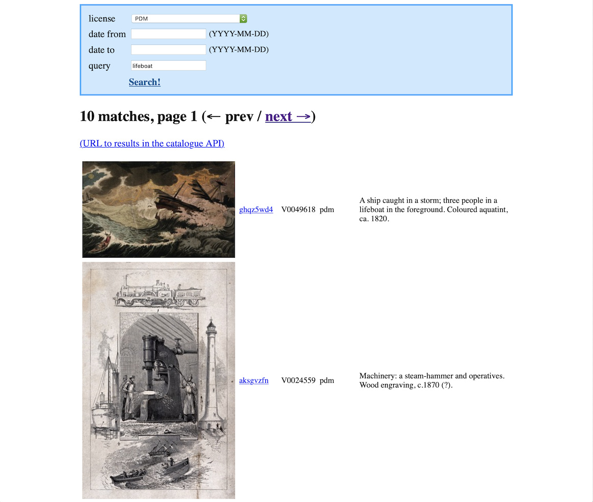

# miro-images-browser

The Miro image browser presents a Miro-focused view on the image data in the [Catalogue API](https://developers.wellcomecollection.org/catalogue).
It's designed for staff who work with the Miro image data specifically, rather than to be a general-purpose image search.
If you don't know what Miro is, you probably want a different tool.

If you want to search all of Wellcome Collection's images, use the [search on wellcomecollection.org](https://wellcomecollection.org/images?query=lifeboat).



The app is hosted on Glitch at <https://miro-images-browser.glitch.me>

The source code is on GitHub at <https://github.com/wellcomecollection/miro-images-browser>

- [Motivation](#motivation)
- [Features](#features)
- [Usage](#usage)
- [Development](#development)
- [Deployment](#deployment)


## Motivation

Miro was the cataloguing software behind Wellcome Images, a collection of medical images, manuscripts and illustrations.
Wellcome Images was subsumed into Wellcome Collection in 2017, and its images are now presented through a [unified collections search][search].

Miro had its own identifier scheme: a letter prefix, followed by a seven-digit number. e.g. B0004807 or V0025133.
These identifiers have been used to cite items in Wellcome Images (for example, in Wikimedia Commons), so we want these identifiers to keep resolving, but we don't emphasise them on wellcomecollection.org.

Some of our staff still work with the Miro data, and use the Miro identifiers.
Because Miro no longer exists, this app presents a Miro-centric view of the data in the Catalogue API.
It's designed to make their work easier, not to be a general-purpose image search.

In particular, it was created to help review some changes to Miro image licences.
It puts the Miro identifier and licence in the search results, whereas they're more hidden on wellcomecollection.org.
This makes it easier to review lots of licence changes, and saves a bunch of clicking through to individual items.

[search]: https://wellcomecollection.org/images


## Features

-   View only Miro images from the Catalogue API
-   Miro identifiers and image licences are visible in the search results
-   Filter by licence, date, and free-text query


## Development

If you want to work on a development version, clone this repo and install dependencies:

```console
$ git clone https://github.com/wellcomecollection/miro-images-browser.git
$ cd miro-images-browser
$ pip3 install -r requirements.txt
```

Then start the server:

```console
$ python3 server.py
```

This will start a debug version of the ingest inspector at <http://localhost:6737>.
Any changes made to the app will be reflected immediately in the running version.


## Deployment

To deploy a new version to Glitch, commit your changes and push a commit to the primary branch on GitHub.
It will be automatically pushed to Glitch using GitHub Actions (based on a [blog post by Melissa McEwen](https://dev.to/glitch/automating-my-deploys-from-github-to-glitch-2fpd)).

Note: our post-receive Git hook differs from that in the blog post; we run

```shell
#!/bin/bash
unset GIT_INDEX_FILE
git --work-tree=/app  --git-dir=/app/.git checkout -f
refresh
```

to trigger [an immediate refresh](https://support.glitch.com/t/restarting-the-project-using-consoles-refresh-command-spawns-another-instance-of-the-project/16987), even if the app is already running.
